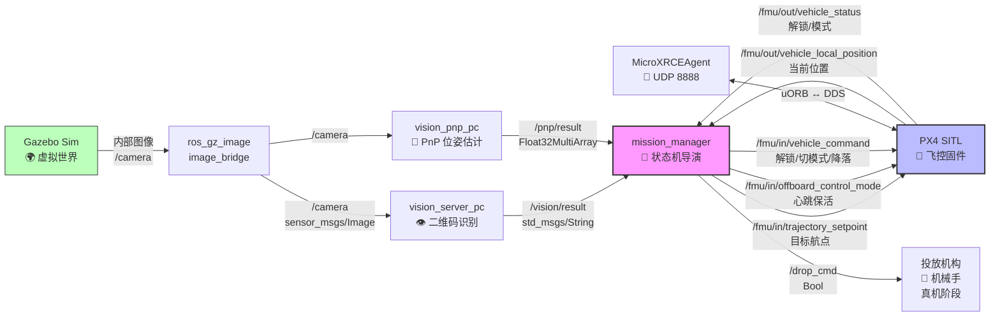
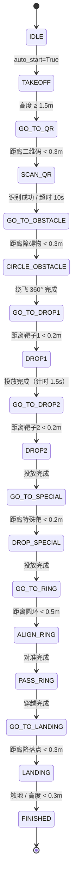
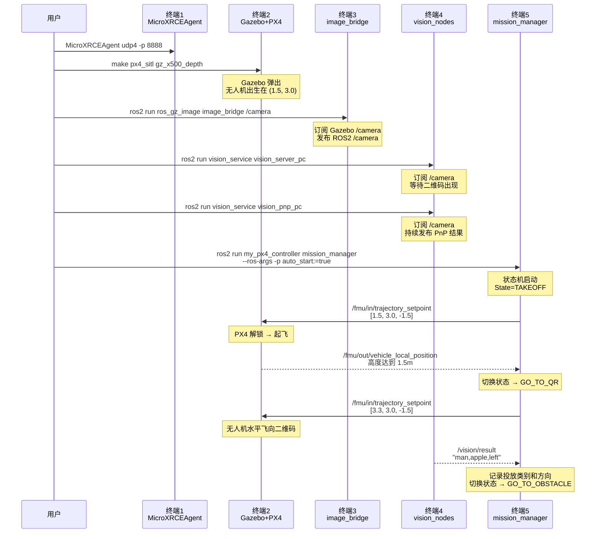

# 🏗️ 微型无人机竞赛 · 完整节点架构与代码逻辑

> [!INFO] 当前状态 **仿真阶段（PC 单机）**，后续迁移到 NX 真机。所有节点已编译通过，mission_manager 状态机已修复高频发布和坐标问题。

## 1. 节点清单（你现在有哪些节点）

### PC 端（Humble，仿真时全部跑在 PC 上）

| 节点名                  | 包名                                | 进程名                        | 作用                               | 状态    |
| :------------------- | :-------------------------------- | :------------------------- | :------------------------------- | :---- |
| [[`MicroXRCEAgent`]] | `px4_ros_com`（官方）                 | `MicroXRCEAgent`           | PX4 ↔ ROS2 通信代理                  | ✅ 运行中 |
| `gz_x500_depth`      | `PX4-Autopilot`（官方）               | `px4` + `gz sim`           | Gazebo 物理引擎 + PX4 飞控固件           | ✅ 运行中 |
| [[`image_bridge`]]   | `ros_gz_image`（官方）                | `image_bridge`             | Gazebo 图像 → ROS2 Topic `/camera` | ✅ 运行中 |
| `vision_server_pc`   | `vision_service`（你写的）             | `python3 vision_server_pc` | 二维码识别 / YOLO 图片分类                | ✅ 运行中 |
| `vision_pnp_pc`      | `vision_service`（你写的）             | `python3 vision_pnp_pc`    | ONNX 目标检测 + PnP 位姿解算             | ✅ 运行中 |
| `mission_manager`    | `my_px4_controller`（Kimi Code 写的） | `python3 mission_manager`  | **主控状态机**，调度全流程                  | ✅ 运行中 |
### NX 端（Foxy，真机阶段迁移）

| 节点名                | 包名               | 作用                          | 状态    |
| :----------------- | :--------------- | :-------------------------- | :---- |
| `vision_server_pc` | `vision_service` | 接真实摄像头，跑二维码/分类              | ⏳ 待迁移 |
| `vision_pnp_pc`    | `vision_service` | 接真实摄像头，跑 PnP 位姿             | ⏳ 待迁移 |
| `dropper_node`     | 待创建              | 订阅 `/drop_cmd`，驱动 GPIO/舵机投放 | ⏳ 待开发 |
## 2. 完整数据流（谁把数据给了谁）



## 3. 代码文件位置（源文件在哪）

```bash
~/competition_ws/ros2_ws/
├── src/
│   ├── vision_service/                    # 视觉包（你和 Kimi 写的）
│   │   └── vision_service/
│   │       ├── __init__.py
│   │       ├── vision_server_pc.py        # ← 二维码 + YOLO 分类
│   │       ├── vision_pnp_pc.py           # ← ONNX 检测 + PnP 解算
│   │       └── utils/
│   │           ├── best.pt                # YOLO 模型（待补充）
│   │           ├── fly_best_300.onnx       # PnP 检测模型 ✅
│   │           ├── classify.py            # 分类工具函数
│   │           ├── detect.py              # 检测工具函数
│   │           └── qrcode_scanner.py      # 二维码工具函数
│   │
│   ├── my_px4_controller/                 # 主控包（Kimi Code 写的）
│   │   └── my_px4_controller/
│   │       ├── __init__.py
│   │       ├── mission_manager.py         # ← 状态机大脑（核心）
│   │       └── frame_transforms.py        # 坐标转换工具
│   │
│   ├── px4_msgs/                            # PX4 官方消息定义
│   └── px4_ros_com/                         # PX4 官方通信桥接
│
├── build/                                   # 编译中间产物
└── install/                                 # 编译结果（ros2 run 从这里加载）
```
## 4. mission_manager 状态机逻辑（核心）

### 4.1 状态定义（代码里是一个 Enum）

```python
class MissionState(Enum):
    IDLE = 0            # 待机
    TAKEOFF = 1         # 起飞到 1.5m
    GO_TO_QR = 2        # 水平飞向二维码 (3.3, 3.0)
    SCAN_QR = 3         # 悬停，等 /vision/result
    GO_TO_OBSTACLE = 4  # 飞向障碍物 (5.8, 3.0)
    CIRCLE_OBSTACLE = 5 # 顺时针绕柱 360°
    GO_TO_DROP1 = 6     # 飞向靶子1 (3.3, 4.6)
    DROP1 = 7            # 下降 <0.8m，发 /drop_cmd=True，等待 1.5s
    GO_TO_DROP2 = 8     # 飞向靶子2 (5.1, 4.6)
    DROP2 = 9            # 第二次投放
    GO_TO_SPECIAL = 10  # 飞向特殊靶 (7.5, 2.0)
    DROP_SPECIAL = 11    # 投放特殊靶
    GO_TO_RING = 12     # 飞向圆环 (7.5, 4.6)
    ALIGN_RING = 13      # 对准圆环中心
    PASS_RING = 14       # 穿越圆环
    GO_TO_LANDING = 15   # 飞向降落点
    LANDING = 16         # 降落指令
    FINISHED = 17        # 结束
```

### 4.2 状态流转图


### 4.3 每个状态在代码里干什么

| 状态                | 代码逻辑（简化）                              | 发布的航点                                 |
| :---------------- | :------------------------------------ | :------------------------------------ |
| `IDLE`            | 悬停在当前位置，`z=0`                         | `[current_x, current_y, 0]`           |
| `TAKEOFF`         | 垂直上升，`z` 从 0 → -1.5                   | `[current_x, current_y, -1.5]`        |
| `GO_TO_QR`        | 水平飞向二维码，高度保持 1.5m                     | `[3.3, 3.0, -1.5]`                    |
| `SCAN_QR`         | 悬停，等 `/vision/result` 数据              | `[3.3, 3.0, -1.5]`                    |
| `CIRCLE_OBSTACLE` | 角度从 π → -π，半径 1.2m，顺时针                | `[5.8+1.2·cosθ, 3.0+1.2·sinθ, -1.5]`  |
| `DROP1`           | 下降 to -0.8，发 `/drop_cmd=True`，计时 1.5s | `[3.3, 4.6, -0.8]`                    |
| `PASS_RING`       | 对准后加速穿越                               | `[7.5, 4.6, -2.2] → [7.5, 4.6, -1.2]` |
## 5. 核心函数调用链（代码怎么跑起来的）

### 5.1 启动顺序（时间线）

### 5.2 mission_manager 内部循环（每 50ms 执行一次）

```python
# 伪代码，真实逻辑比这复杂，但骨架一样
def control_loop(self):           # 20Hz 定时触发
    1. 获取当前状态 (self.current_state)
    2. 根据状态调用对应 handle 函数：
       - TAKEOFF → handle_takeoff()
       - GO_TO_QR → handle_go_to_qr()
       - SCAN_QR → handle_scan_qr()
       - ...
    3. 每个 handle 里：
       a. 计算目标航点 (x, y, z)
       b. 检查是否到达（距离 < 阈值）
       c. 如果到达，切换下一个状态
    4. 发布航点：publish_trajectory_setpoint(x, y, z)
    5. 发布心跳：publish_offboard_control_mode()
    6. 必要时发布命令：publish_vehicle_command(解锁/降落)
```

## 6. 你现在能做什么 / 还不能做什么

### ✅ 已完成的

- [x] Gazebo 仿真环境启动（场地 + 无人机 + 摄像头朝下）
    
- [x] 图像链路打通（Gazebo → ROS2 `/camera`）
    
- [x] 二维码识别（`pyzbar`，`mode:=qrcode`）
    
- [x] PnP 位姿发布（ONNX 检测 + OpenCV solvePnP）
    
- [x] mission_manager 状态机（17 个状态，顺时针绕柱，三次投放）
    
- [x] PX4 Offboard 控制（起飞、悬停、水平飞行、降落）
    
- [x] 命令去重（500ms 防风暴，不卡不崩）
    

### ⏳ 待完成的

- [ ] **YOLO 分类模型**：`best.pt` 缺失，classify 模式跑不了
    
- [ ] **PnP 闭环**：`/pnp/result` 数据没接入 mission_manager 的穿环逻辑
    
- [ ] **投放机构**：真机 GPIO/舵机节点，订阅 `/drop_cmd`
    
- [ ] **真机迁移**：NX 上接真实摄像头，替换 Gazebo `/camera`
    
- [ ] **参数整定**：飞行速度、悬停时间、阈值微调

## 7. 调试时怎么看逻辑在跑

```bash
# 1. 看状态机当前在哪个状态
ros2 topic echo /fmu/in/trajectory_setpoint
# 观察 position.x / position.y 变化，推断当前目标

# 2. 看视觉识别结果
ros2 topic echo /vision/result

# 3. 看 PnP 位姿
ros2 topic echo /pnp/result

# 4. 看 PX4 当前模式（是否在 Offboard）
ros2 topic echo /fmu/out/vehicle_status | grep nav_state
# 14 = Offboard, 0 = Manual

# 5. 看所有节点是否活着
ros2 node list

# 6. 可视化节点连接图
ros2 run rqt_graph rqt_graph
```
