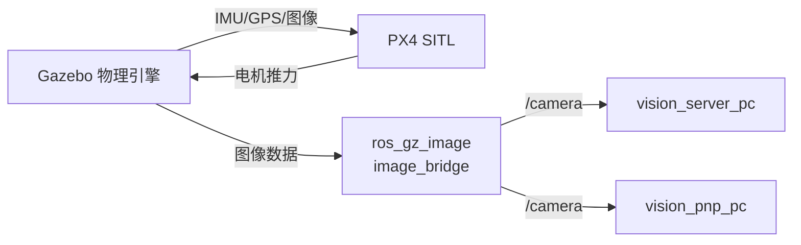

## 节点 7：Gazebo Sim（物理引擎）

> [!INFO] 仿真世界，不是 ROS2 节点，但和 ROS2 通过插件交互

### 它是干嘛的

**虚拟宇宙**。计算重力、空气阻力、碰撞、电机推力，让无人机在虚拟场地里真实飞行。

### 和你的节点关系

### 关键配置（你改过的）

- `x500_depth/model.sdf`：把 OakD-Lite 相机朝下（Pitch -1.57）
    
- `my_world.sdf`：定义了 9m×6m 场地、起飞点、二维码、靶子、障碍物、圆环