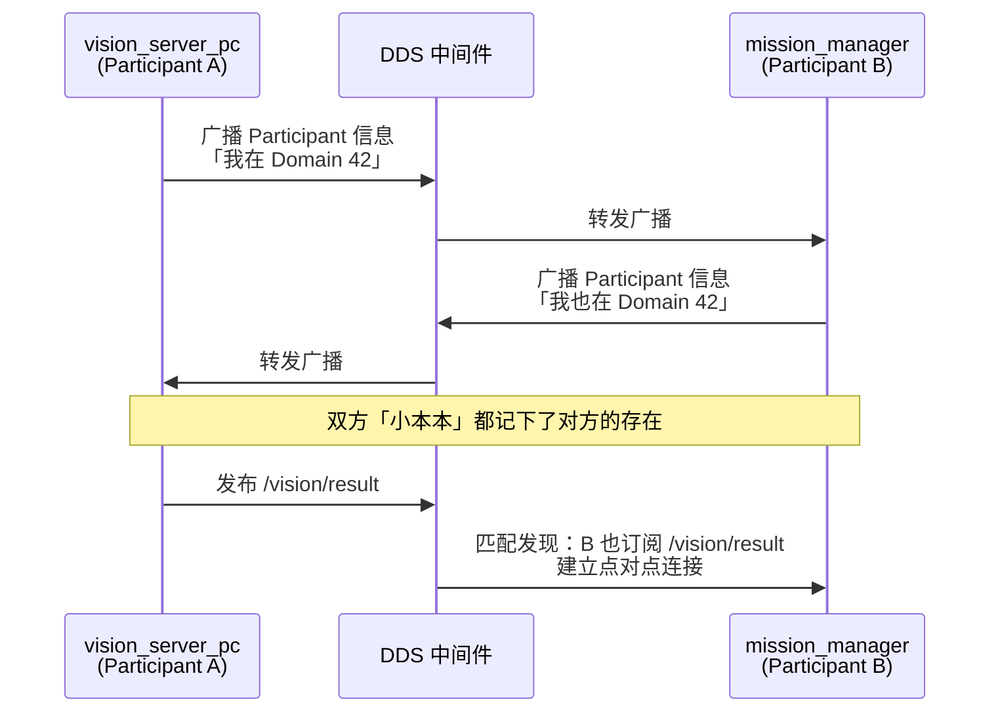
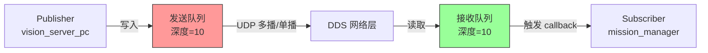
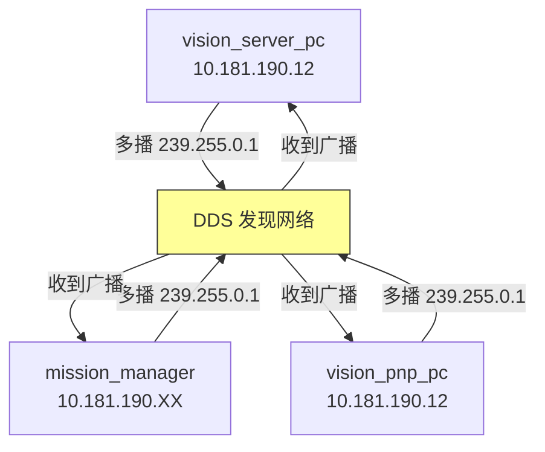

# 📡 DDS（Data Distribution Service）：ROS2 的「神经系统」

> [!INFO] 一句话定义 **DDS 是一个工业级的「发布-订阅中间件标准」**，规定了进程之间怎么互相发现、怎么传数据、怎么保证不丢包。ROS2 不是从零写通信代码，而是站在 DDS 这个巨人的肩膀上。

## 1. 生活类比：从「微信群」升级到「广播电台」

| 维度       | ROS1（自定义通信层）            | ROS2（基于 DDS）                     |
| :------- | :---------------------- | :------------------------------- |
| **发现机制** | 必须有一个「群主」（roscore）登记所有人 | **没有群主**，大家靠「广播」互相发现             |
| **通信方式** | 私聊（TCP 点对点连接）           | **广播电台**（UDP 多播，一人讲多人听）          |
| **跨机器**  | 配置复杂，依赖 roscore 互通      | **零配置**，插上网线自动发现                 |
| **实时性**  | 尽力而为，无 QoS 概念           | **服务质量（QoS）**，可配置「必须送到」或「丢了也没关系」 |
| **工业级**  | 实验室玩具                   | 汽车、飞机、军舰都在用                      |
**通俗理解：**

- ROS1 = 微信群：必须有一个群主（roscore）拉群，成员才能聊天。群主挂了，全群失联。
    
- ROS2 = 调频广播电台：主播（Publisher）打开麦克风在 103.7MHz（Topic）喊话，听众（Subscriber）调到这个频率就能收到。**主播不知道有多少人在听，也不需要知道。**

## 2. DDS 是什么？（技术定义）

**DDS 不是某个具体软件，而是一个「通信协议标准」**，由 OMG（Object Management Group）制定，类似于 HTTP 协议标准。

**符合 DDS 标准的具体实现（ROS2 支持的）：**

| 实现名称            | 厂商            | 特点                  | 你项目里的使用                            |
| :-------------- | :------------ | :------------------ | :--------------------------------- |
| **Fast DDS**    | eProsima      | ROS2 Humble 默认，性能均衡 | PC 单机仿真默认使用                        |
| **CycloneDDS**  | Eclipse       | 轻量，跨平台兼容好           | NX（Foxy）强制使用（Fast DDS 在 aarch64 崩） |
| **RTI Connext** | RTI           | 商业级，最稳定，最贵          | 比赛/工业常用，但你没用                       |
| **GurumDDS**    | GurumNetworks | 韩国出品，亚洲常用           | 你没用过                               |
**ROS2 的做法**
```plain
你的 Python 代码 (rclpy)
    ↓
ROS2 客户端库 (rclpy / rclcpp)
    ↓
RMW 接口层 (ROS Middleware Interface)
    ↓
具体 DDS 实现 (Fast DDS / CycloneDDS / ...)
    ↓
操作系统网络栈 (UDP / TCP / Shared Memory)
```
>[!NOTE] RMW = ROS Middleware ROS2 故意设计了一层「RMW」抽象，让你可以**不换代码，只换环境变量**，就能切换底层 DDS。这就是你之前执行的 `export RMW_IMPLEMENTATION=rmw_cyclonedds_cpp`。
## 3. DDS 核心概念

### 3.1 Domain（域）→ 聊天室房间号

**定义：** 同一个 Domain 内的节点才能互相发现，不同 Domain 完全隔离。
**你的项目：**
```bash
# PC 和 NX 两边都设成 42，表示「都在 42 号房间聊天」
export ROS_DOMAIN_ID=42
```
**如果设错了：**
```bash
# PC 设 42，NX 设 0
# 结果：两边各自在自己的房间喊话，永远听不见对方
```
**类比：** 微信群里，Domain 42 = 「2026 无人机竞赛群」，Domain 0 = 「家庭群」。两个群消息不互通。
### 3.2 Participant（参与者）→ 节点的「身份证」

**定义：** 每个 ROS2 节点启动时，DDS 会创建一个 Participant，包含：

- 节点名字（`vision_server_pc`）
    
- GUID（全局唯一 ID，DDS 自动分配）(身份证号专门用来区分相同名字节点)
    
- 它发布的 Topic 列表
    
- 它订阅的 Topic 列表

**你的项目里：**
```bash
# 这行代码背后，DDS 创建了一个 Participant
super().__init__("vision_server_pc")

# DDS 广播：「我是 vision_server_pc，我在 Domain 42，
# 我发布 /vision/result，我订阅 /camera」
```


### 3.3 Topic（话题）→ 广播频道

**定义：** 数据的「频道名」，发布者和订阅者通过 Topic 名匹配，不关心对方是谁。

**你的项目 Topic 清单：**

| Topic 名                           | 消息类型                            | 发布者                | 订阅者                                    | 作用        |
| :-------------------------------- | :------------------------------ | :----------------- | :------------------------------------- | :-------- |
| `/camera`                         | `sensor_msgs/Image`             | `image_bridge`     | `vision_server_pc`<br/>`vision_pnp_pc` | 图像数据      |
| `/vision/result`                  | `std_msgs/String`               | `vision_server_pc` | `mission_manager`                      | 二维码识别结果   |
| `/pnp/result`                     | `std_msgs/Float32MultiArray`    | `vision_pnp_pc`    | `mission_manager`                      | 位姿估计（未接入） |
| `/fmu/in/trajectory_setpoint`     | `px4_msgs/TrajectorySetpoint`   | `mission_manager`  | `MicroXRCEAgent`<br/>→ PX4             | 目标航点      |
| `/fmu/out/vehicle_local_position` | `px4_msgs/VehicleLocalPosition` | PX4 → Agent        | `mission_manager`                      | 当前位置反馈    |


**关键特性：**

- **解耦**：`vision_server_pc` 发布 `/vision/result` 时，**不知道** `mission_manager` 是否存在
    
- **多对多**：多个节点可以发布同一个 Topic，多个节点可以订阅同一个 Topic
    
- **持久化**：即使订阅者启动得比发布者晚，DDS 也能在订阅者上线后建立连接（只要发布者还在发）

### 3.4 Publisher / Subscriber（发布者/订阅者）→ 嘴巴和耳朵

**Publisher（发布者）：**
```python
# vision_server_pc.py
self.pub = self.create_publisher(String, "/vision/result", 10)
# 最后这个 10 = QoS 队列深度（缓存 10 条消息）
```
**Subscriber（订阅者）：**
```python
# mission_manager.py
self.sub = self.create_subscription(
    String, "/vision/result", self.callback, 10
)
```


| QoS 参数          | 选项                | 适用场景              | 你的项目实例                                  |
| :-------------- | :---------------- | :---------------- | :-------------------------------------- |
| **Reliability** | `RELIABLE`        | 必须送到，允许重传         | `/fmu/in/trajectory_setpoint`（飞控指令不能丢）  |
|                 | `BEST_EFFORT`     | 丢了没关系，追求低延迟       | `/camera`（图像帧丢了就丢，看下一帧）                 |
| **Durability**  | `VOLATILE`        | 只关心实时数据           | `/vision/result`（只要最新结果）                |
|                 | `TRANSIENT_LOCAL` | 新订阅者能收到「最后一条」历史消息 | 参数配置（启动时读取最新配置）                         |
| **History**     | `KEEP_LAST`       | 只保留最近 N 条         | 所有 Topic 默认用这个                          |
|                 | `KEEP_ALL`        | 保留所有（内存会爆）        | 数据记录（ros2 bag）                          |
| **Depth**       | `N`               | 队列深度              | `create_publisher(..., 10)` 就是 depth=10 |

**你代码里的 QoS（默认）：**
```python
# rclpy 默认 QoS = RELIABLE + KEEP_LAST + depth=10
self.pub = self.create_publisher(String, "/vision/result", 10)
```
**为什么 `/camera` 应该用 BEST_EFFORT：**
```python
from rclpy.qos import QoSProfile, ReliabilityPolicy

# 图像流用 BEST_EFFORT，降低带宽和延迟
qos = QoSProfile(
    reliability=ReliabilityPolicy.BEST_EFFORT,
    depth=1  # 只保留最新一帧
)
self.sub = self.create_subscription(
    Image, "/camera", self.callback, qos
)
```


## 4. DDS 发现机制：节点怎么「找到」彼此？

### 4.1 简单发现（Simple Discovery）→ 默认方式

**原理：** 多播广播（Multicast）


**问题：** 很多路由器/热点会**阻断多播**（你之前遇到的就是这个）。

**你的现象：**

- `ping` 能通（单播 IP 层正常）
    
- `ros2 topic list` 互相看不到（多播被吃了，DDS 发现失败）

### 4.2 静态发现（Static Discovery）→ 你的解法

**原理：** 手动指定 Peer 地址，不走多播。

**你的 CycloneDDS XML 配置：**

```xml
<CycloneDDS>
  <Domain id="42">
    <General>
      <AllowMulticast>false</AllowMulticast>  <!-- 禁用多播 -->
    </General>
    <Discovery>
      <Peers>
        <Peer address="10.181.190.12"/>   <!-- NX 的 IP -->
        <Peer address="10.181.190.XX"/>   <!-- PC 的 IP -->
      </Peers>
    </Discovery>
  </Domain>
</CycloneDDS>
```
**效果：** DDS 直接通过单播 UDP 连接对方，绕过被阻断的多播。
## 5. 序列化：从 Python 对象到网络字节

### 5.1 CDR（Common Data Representation）

**定义：** DDS 规定的数据序列化格式，把 Python/C++ 的 `class`/`struct` 转成二进制字节流。

**流程：**
```python
# 1. Python 侧构造消息对象
msg = String()
msg.data = "man,apple,left"

# 2. rclpy 把 Python 对象 → CDR 二进制
#    内部调用 rosidl_generator_py 生成的序列化代码
binary_data = serialize_to_cdr(msg)

# 3. DDS 把 CDR 二进制 → UDP 包
udp_packet = dds_write(binary_data)

# 4. 网络传输到另一台机器

# 5. 对方 DDS 收到 UDP 包 → CDR 二进制

# 6. 对方 rclpy 把 CDR 二进制 → Python 对象
msg = deserialize_from_cdr(binary_data)
```

### 5.2 Fast CDR 异常（你遇到的致命错误）

> [!ERROR] `Fast CDR exception deserializing message of type px4_msgs::msg::dds_::VehicleLocalPosition_`

**根因：** 发送方和接收方的 **CDR 格式定义不一致**。

**具体到你项目：**

| 组件              | px4\_msgs 版本 | CDR 定义                        |
| :-------------- | :----------- | :---------------------------- |
| PX4 固件 SITL     | `v1.14.3`    | 字段 A, B, C, D（按这个顺序）          |
| PC 的 `px4_msgs` | `main` 分支    | 字段 A, C, B, D（顺序不同，可能多了/少了字段） |
**后果：** PX4 发送的 CDR 二进制有 100 字节，ROS2 的 `px4_msgs` 期望 96 字节 → 解析越界 → `Fast CDR exception`。

**修复：** Kimi Code 帮你把 `px4_msgs` 切到 `release/1.14` 分支，与 PX4 固件版本严格对齐。

## 6. 代码层面的 DDS：rclpy 怎么调用底层？

### 6.1 你写的每一行 ROS2 代码，背后都是 DDS

```python
import rclpy
from rclpy.node import Node

class VisionServerPC(Node):
    def __init__(self):
        super().__init__("vision_server_pc")  # ← DDS: 创建 Participant
        
        # ← DDS: 声明 Topic /camera，创建 Subscriber Endpoint
        self.create_subscription(Image, "/camera", self.cb, 10)
        
        # ← DDS: 声明 Topic /vision/result，创建 Publisher Endpoint
        self.pub = self.create_publisher(String, "/vision/result", 10)

def main():
    rclpy.init()          # ← DDS: 初始化 Domain（默认从 ROS_DOMAIN_ID 读）
    node = VisionServerPC()
    rclpy.spin(node)      # ← DDS: 进入事件循环，等 Publisher/Subscriber 回调
    node.destroy_node()   # ← DDS: 销毁 Participant，注销 Graph
    rclpy.shutdown()      # ← DDS: 清理 Domain 资源
```

### 6.2 环境变量控制 DDS 行为
```bash
# 切换 DDS 实现（RMW 层）
export RMW_IMPLEMENTATION=rmw_cyclonedds_cpp   # 或 rmw_fastrtps_cpp

# 选择 Domain（房间号）
export ROS_DOMAIN_ID=42

# CycloneDDS 额外配置（单播发现）
export CYCLONEDDS_URI=file:///home/zlz/cyclonedds_pc.xml

# Fast DDS 额外配置
export FASTRTPS_DEFAULT_PROFILES_FILE=/path/to/fastdds.xml
```

## 7. 调试 DDS 的实用指令
```bash
# 1. 查看当前使用的 DDS 实现
echo $RMW_IMPLEMENTATION

# 2. 查看 Domain 内所有 Participant（DDS 层）
ros2 daemon status
ros2 node list

# 3. 查看 Topic 的 QoS 配置
ros2 topic info /camera --verbose

# 4. 查看 DDS 层统计（CycloneDDS 专用）
CYCLONEDDS_URI= ros2 topic list  # 不带配置，看默认行为

# 5. 抓包分析 DDS 通信（高级）
sudo tcpdump -i any udp port 7400  # DDS 默认端口范围 7400-7500

# 6. 查看 RMW 层日志（排查发现失败）
ROS_LOG_LEVEL=DEBUG ros2 run vision_service vision_server_pc
```
## 8. 你项目里的 DDS 决策复盘
| 决策                     | 为什么这样做                 | DDS 原理                              |
| :--------------------- | :--------------------- | :---------------------------------- |
| **PC 单机仿真用 Fast DDS**  | Humble 默认，无需额外安装       | ROS2 默认 RMW                         |
| **NX 强制 CycloneDDS**   | Fast DDS 在 aarch64 段错误 | 不同 DDS 实现底层代码不同                     |
| **跨机时两边统一 CycloneDDS** | 避免 RMW 混用导致协商失败        | 同一 Domain 内 RMW 实现不同通常能互通，但版本敏感     |
| **单播 XML 配置**          | 手机热点吃多播                | `AllowMulticast=false` + `<Peers>`  |
| **px4\_msgs 版本对齐**     | 防止 CDR 序列化不匹配          | 消息定义必须与固件严格一致                       |
| **`/camera` 用默认 QoS**  | 图像流丢帧可接受               | `RELIABLE` 其实对图像过重，可改 `BEST_EFFORT` |
