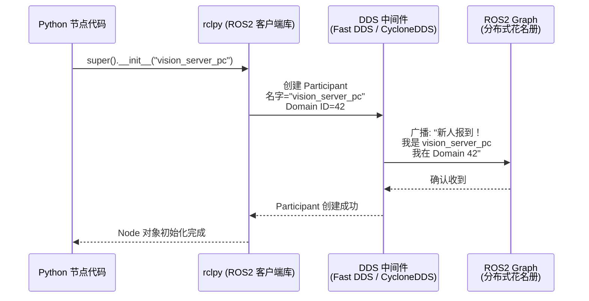

# 🕸️ ROS2 Graph（图）：节点的「社交网络」

> [!INFO] 一句话 **ROS2 Graph 是一个实时更新的「节点花名册」**，记录当前所有活着的节点、它们发布的话题、订阅的话题。`super().__init__("vision_server_pc")` 就是向这个花名册**报名登记**。

## 1. 生活类比：公司入职系统
| 现实世界                 | ROS2 对应                                |
| :------------------- | :------------------------------------- |
| 你入职新公司，HR 在系统里录入你的名字 | `super().__init__("vision_server_pc")` |
| 公司通讯录（能看到所有员工）       | **ROS2 Graph**                         |
| 你的工位、部门、联系方式         | 节点发布的 **Topic**、**Service**、**Action** |
| 同事通过通讯录找到你           | 其他节点通过 Graph **自动发现** 你                |
| 你离职了，HR 把你从通讯录删掉     | 节点销毁时，**从 Graph 注销**                   |
| 两个同名员工（都叫张三）         | **节点重名冲突**，后入职的顶掉先入职的                  |
## 2. 技术拆解：这行代码背后发生了什么？
```python
super().__init__("vision_server_pc")
```



| 步骤                   | 技术名词            | 通俗解释                                          |
| :------------------- | :-------------- | :-------------------------------------------- |
| **① 创建 Participant** | DDS Participant | DDS 层的「身份证」，代表这个进程加入了某个聊天室（Domain）            |
| **② 分配 Node ID**     | GUID            | DDS 给这个 Participant 发一个全球唯一编号（类似身份证号）         |
| **③ 广播发现报文**         | Discovery       | 向同 Domain 的所有电脑喊：「我是 vision\_server\_pc，我来了！」 |
| **④ 写入 Graph**       | ROS2 Graph      | 所有节点收到广播后，更新自己的「小本本」：「vision\_server\_pc 活着」  |
| **⑤ 建立通信通道**         | Topic/Endpoint  | 如果有其他节点订阅了 `/vision/result`，DDS 开始建立点对点连接     |
