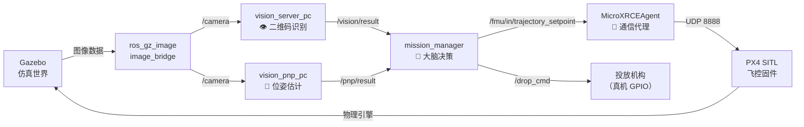

# 🧩 ROS2 节点（Node）：从生活到代码

> [!INFO] 一句话定义 **节点就是一个「有名字、能说话、能听话」的独立进程。** 它只关心自己该干嘛，不关心其他节点是谁、在哪台电脑上。

## 1. 生活类比：微信群聊
| 现实世界        | ROS2 技术对应           | 作用               |
| :---------- | :------------------ | :--------------- |
| 你（微信名：张三）   | **节点（Node）**        | 一个独立的进程，有唯一名字    |
| 你在群里发文字     | **Publisher（发布者）**  | 往某个 Topic 扔数据    |
| 你在群里看消息     | **Subscriber（订阅者）** | 从某个 Topic 取数据    |
| 「家庭群」这个群名   | **Topic（话题）**       | 数据的「频道」          |
| 微信服务器       | **DDS（中间件）**        | 帮你转发消息，你不需要@具体的人 |
| 你发了消息，但李四没回 | **解耦**              | 发布者不知道订阅者是否存在    |
**核心特点：**

- 张三发消息时，**不知道群里有没有李四**，也不需要知道
    
- 李四退群了，**张三照样能发**，不受影响
    
- 王五突然加群，**立刻能看到**之后的新消息
    

> [!NOTE] 这就是 ROS2 的「去中心化」 没有「群主」管着大家，每个节点独立存活。DDS 只负责「快递包裹」，不负责「登记户口」。

## 2. 技术拆解：节点到底是个啥？
### 2.1 它是一个操作系统进程
```bash
# 你启动 vision_server_pc 后，系统里真的多了一个进程
ps aux | grep vision_server_pc  
# 输出：python3 /home/zlz/.../vision_server_pc
```
#### 指令解析

| 部分     | 含义                 | 作用                                      |
| :----- | :----------------- | :-------------------------------------- |
| `ps`   | **Process Status** | 查看系统里有哪些进程在跑                            |
| `a`    | all                | 显示**所有终端**的进程（不只是你当前这个终端）               |
| `u`    | user-oriented      | 显示**详细信息**（CPU占用、内存、启动用户、启动时间）          |
| `x`    | 无终端进程              | 显示**后台/守护进程**（ROS2 节点通常属于这类）            |
| **\|** | 管道                 | 把 `ps aux` 的输出，塞给下一个命令处理                |
| `grep` | 文本过滤器              | 从一大堆进程里，**只保留**包含 `vision_server_pc` 的行 |
##### 📋 通俗类比

想象你的电脑是一个**医院**：

- `ps aux` = **广播**：「请全院所有病人（进程）到走廊集合，带上病历本（CPU/内存信息）」
    
- `grep vision_server_pc` = **门口保安**：「只让名字里带 `vision_server_pc` 的病人通过，其他的拦下」
##### 🖥️ 实际输出示例
```bash
zlz@zlz-Legion-Y9000P-IRX9:~$ ps aux | grep vision_server_pc
zlz      12345  12.3  1.2  2567894  98765 ?  Sl  20:15  0:45 python3 /home/zlz/competition_ws/ros2_ws/install/vision_service/lib/vision_service/vision_server_pc
zlz      12346   0.0  0.0   8900   700 pts/0  S+  20:20  0:00 grep --color=auto vision_server_pc
```

| 列         | 值       | 含义                                     |
| :-------- | :------ | :------------------------------------- |
| `zlz`     | 用户名     | 这个进程是谁启动的                              |
| `12345`   | **PID** | 进程身份证号（Process ID），杀进程要用它              |
| `12.3`    | CPU%    | 占用了 12.3% 的 CPU                        |
| `1.2`     | MEM%    | 占用了 1.2% 的内存                           |
| `2567894` | VSZ     | 虚拟内存大小（KB）                             |
| `98765`   | RSS     | 实际物理内存（KB）                             |
| `?`       | TTY     | 控制终端（`?` 表示后台进程，没有终端）                  |
| `Sl`      | STAT    | 状态：`S`=睡眠（等消息），`l`=多线程                 |
| `20:15`   | START   | 启动时间                                   |
| `0:45`    | TIME    | 累计 CPU 时间（跑了 45 秒）                     |
| 最后        | COMMAND | 完整启动命令（`python3 .../vision_server_pc`） |

>[!NOTE] 第二行是 `grep` 自己 `grep` 命令本身也包含 `vision_server_pc` 这个字符串，所以它也会把自己匹配出来。这是正常现象。

- **崩溃隔离**：`vision_server_pc` 崩了，`mission_manager` 不会跟着崩


- **分布式**：`mission_manager` 在 PC 上跑，`vision_server_pc` 在 Jetson NX 上跑，通过 DDS 自动发现

### 2.2 它在 [[ROS2 图]]（Graph）里注册了名字

启动时自动完成：
```bash
super().__init__("vision_server_pc")  # ← 向 ROS2 Graph 注册
```
注册后：
```bash
ros2 node list
# 输出：
# /vision_server_pc
# /mission_manager
# /pnp_node_pc
```
### 2.3 它长了「嘴巴」和「耳朵」

```python
# 耳朵：订阅 /camera（接收图像）
self.subscription = self.create_subscription(
    Image,           # 消息类型
    "/camera",       # 话题名（频道）
    self.callback,   # 收到消息后调用这个函数
    10               # 队列长度（缓存10帧）
)

# 嘴巴：发布到 /vision/result（喊出识别结果）
self.pub = self.create_publisher(
    String,          # 消息类型
    "/vision/result",# 话题名（频道）
    10               # 队列长度
)
```

>[!WARNING] 嘴巴和耳朵互相不认识 `vision_server_pc` 的嘴巴对着 `/vision/result` 喊，它**不知道**是谁在听。可能是 `mission_manager`，也可能是你调试时开的 `ros2 topic echo`。

## 3. 生命周期：节点的一生

```plain
┌─────────────┐     ┌──────────────┐     ┌─────────────┐
│  1. 出生    │────▶│  2. 注册Graph │────▶│  3. 长嘴巴   │
│ rclpy.init()│     │super().__init__│   │ create_publisher │
└─────────────┘     └──────────────┘     └─────────────┘
                                                │
┌─────────────┐     ┌──────────────┐           │
│  6. 死亡    │◀────│  5. 处理消息   │◀──────────┘
│destroy_node()│    │   callback()   │
└─────────────┘     └──────────────┘
       ▲
       └────────────────────────────┐
              4. 存活（阻塞等待）     │
              rclpy.spin(node)      │
```
**关键函数：**

| 阶段  | 代码                                             | 作用                  |
| :-- | :--------------------------------------------- | :------------------ |
| 出生  | `rclpy.init()`                                 | 初始化 ROS2 客户端库       |
| 注册  | `Node("名字")`                                   | 向 DDS 注册，加入 Graph   |
| 长器官 | `create_subscription()` / `create_publisher()` | 绑定话题                |
| 存活  | `rclpy.spin(node)`                             | **阻塞**，保持节点不退出，等待回调 |
| 死亡  | `node.destroy_node()`                          | 注销 Graph，释放 DDS 资源  |

>[!IMPORTANT] `rclpy.spin(node)` 是核心 没有这行，节点启动后立刻结束。`spin` 就是「进入事件循环」，等消息来、等定时器触发。
## 4. 实战：你项目里的节点关系图

**节点间的「解耦」体现：**

- `vision_server_pc` 崩了 → `mission_manager` 收不到 `/vision/result`，但**不会崩**，只是停在当前状态
    
- `mission_manager` 重启 → `vision_server_pc` **不需要重启**，继续发它的结果
    
- 你想调试 → 可以单独启动 `ros2 run vision_service vision_server_pc`，**不需要启动 PX4**

## 5. 最小可运行实例

**保存为 `~/test_node.py`，直接 `python3` 就能跑：**

```python
#!/usr/bin/env python3
import rclpy
from rclpy.node import Node
from std_msgs.msg import String

class Talker(Node):
    def __init__(self):
        super().__init__("zhangsan")              # 注册名字：张三
        
        # 长一张嘴巴，对着 "/chatter" 话题喊话
        self.pub = self.create_publisher(String, "/chatter", 10)
        
        # 每 1 秒喊一次
        self.create_timer(1.0, self.say_hello)
        self.count = 0

    def say_hello(self):
        msg = String()
        msg.data = f"我是张三，第 {self.count} 次喊话"
        self.pub.publish(msg)
        self.get_logger().info(f"已发送: {msg.data}")
        self.count += 1

def main():
    rclpy.init()              # 1. 出生
    node = Talker()           # 2. 注册 + 长器官
    rclpy.spin(node)          # 3. 存活（阻塞在这里）
    node.destroy_node()       # 4. 死亡
    rclpy.shutdown()

if __name__ == "__main__":
    main()
```

**运行验证：**
```bash
# 终端 1：启动节点
source /opt/ros/humble/setup.bash
python3 ~/test_node.py

# 终端 2：监听（不需要知道是谁在发）
ros2 topic echo /chatter

# 终端 3：查看节点列表
ros2 node list
# 输出：/zhangsan
```

## 6. 调试指令速查

```bash
# 看谁还活着
ros2 node list

# 看某个节点的「体检报告」（发布了啥、订阅了啥、用了哪些服务）
ros2 node info /mission_manager

# 看整个系统的「社交网络图」（可视化节点连接）
ros2 run rqt_graph rqt_graph

# 手动给一个话题发消息（假装是一个节点）
ros2 topic pub /chatter std_msgs/msg/String '{data: "伪装者发来的消息"}'
```
